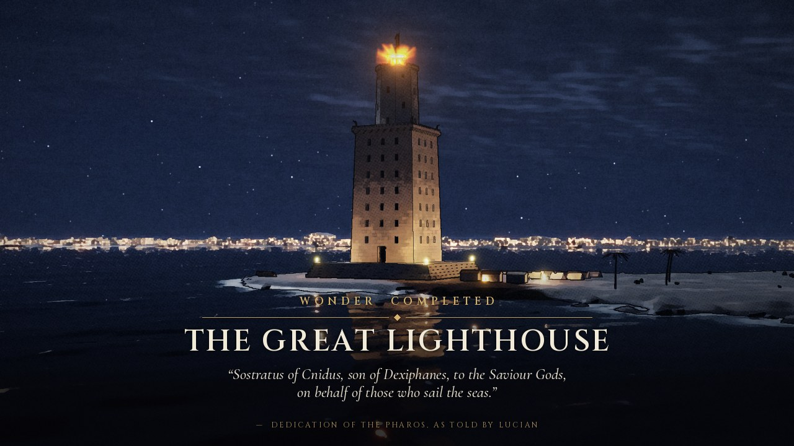

# The Great Lighthouse — a wonder time-lapse

A 30-second, Civilization-VI-style "wonder completed" film: the Pharos of
Alexandria rising course by course on its headland, in a dark, comic-realistic
look. Everything is generated from code. There are no models, textures or
samples, only two SIL-OFL fonts for the titles.

**Output:** [`great_lighthouse_timelapse.mp4`](great_lighthouse_timelapse.mp4): 1280×720, 24 fps, H.264 + AAC stereo, 30 s (22 MB).



## What happens

| video time | time-lapse clock | construction |
|---|---|---|
| 0–1.4 s | pre-dawn → sunrise | survey stakes and ropes mark out the podium; caption *Pharos · Alexandria* |
| 1.0–4.6 s | morning | the stepped stone podium is laid, block by block |
| 4.4–14.8 s | day 1 → night → day 2 | the square first tier (≈56 m, 40 courses) with windows, great door, core shaft and floors; a climbing putlog scaffold and two derricks ride up with the work; work slows to a crawl at night, by torchlight |
| 14.5–15.6 s | afternoon | stepped cornice, roof slab, crenellated parapet, the four bronze Tritons |
| 15.4–20.6 s | day 2 → night → day 3 | the octagonal second tier (≈27 m); tier-1 scaffold is struck top-down |
| 21.0–22.8 s | day 3 | drum, eight-column lantern, entablature, stepped dome |
| 22.6–23.6 s | golden hour | a tall derrick hoists the bronze Zeus Soter onto the dome |
| 23.4–24.9 s | sunset | remaining scaffold and cranes come down |
| 25.4 s | night | the beacon is lit |
| 26.2–30 s | night | "Wonder completed: The Great Lighthouse" and the Pharos's dedication inscription |

Throughout, clouds and cloud shadows race over land and sea, the sun and moon
swing the shadows round, stone barges shuttle to the quay, ships cross the
Great Harbour, and Alexandria's lights come on across the water every night.

## How it is made

| file | role |
|---|---|
| `timeline.py` | Shared timing: construction phases, the time-lapse clock (video seconds → hour of day), sun and moon geometry for Alexandria, and a daylight-weighted work rate. |
| `geometry.py` | numpy generators: ashlar courses for tapered square, octagonal and round ring walls (staggered joints, window and door openings), slabs, beams, heightfields, a radial-LOD sea mesh. |
| `scene.py` | Blender (bpy) scene: materials (per-block tone, mortar joints from per-face UVs), procedural sky (gradient, sun glow, 2-D cloud deck, moon), Ocean-modifier sea with surf foam, the island, Alexandria, props, cranes, workers, ships, beacon; `pose(t)` sets everything for a given instant. The masonry and scaffolding are rebuilt each frame from timed elements, so the building grows block by block. Nothing morphs. |
| `render.py` | Cycles CPU render per frame: an OIDN-denoised beauty EXR, plus a 1.5× depth/normal/object-id pass turned into ink lines. |
| `lines.py` | Ink extraction: inverse-depth Laplacian (silhouettes), normal creases, object-id contacts, distance-weighted pen. |
| `stylize.py` | Graphic-novel look: haze, auto-exposure (darker at night), glow and beacon god rays, ACES tone map, Kuwahara paint, soft cel banding, spot blacks, halftone screen, inks, split-tone grade, stars that turn about the celestial pole, vignette, paper and grain. |
| `titles.py` | Opening caption and end card (Cinzel / Cormorant Garamond). |
| `audio.py` | Synthesized score and sound design (numpy/scipy): a D-Phrygian frame-drum groove whose A7(b9) → D-major cadence lands on the ignition, oud-like Karplus-Strong ostinato, pads, choir, gong; sea, wind, chisels, crickets, fire. |
| `make_film.sh` | Runs the whole pipeline. |

### Build

```bash
python3.11 -m venv venv && venv/bin/pip install -r wonder_film/requirements.txt
# Linux headless: apt install ffmpeg libegl1 libegl-mesa0
PYTHON=venv/bin/python wonder_film/make_film.sh            # all 720 frames
PYTHON=venv/bin/python wonder_film/make_film.sh --skip-existing   # resume
# quick look: a few low-res frames
venv/bin/python wonder_film/render.py --out /tmp/prev --frames 120,360,650 --res 640x360 --spp 4
venv/bin/python wonder_film/stylize.py --inp /tmp/prev --out /tmp/prev_png
```

The film in this folder was rendered on a 4-core CPU with no GPU: 6 samples per
pixel plus OIDN, about 10 s per frame with two render processes, so roughly 2 h
for all 720 frames. Stylizing takes about 3 min with 4 processes, and the
encode about 1 min (`-crf 22 -tune film`).

## Civ1 game film: *Der Leuchtturm* (20 s)

The same scene, re-cut as a 20-second wonder film for the Civ1 remake
(`wunderfilm_04_lighthouse`, storyboard in
[`storyboards/runde1_fehlende_wunder.md`](storyboards/runde1_fehlende_wunder.md)).
It uses the bright, painterly look of the other game films and has no text in
the picture, because the game shows the title and year itself.

| shot | time | what you see | clock |
|---|---|---|---|
| S1 | 0–3 s | the quay on Pharos, morning: a crane swings a block off a barge, a team drags a sledge, ox carts leave for the site, gulls | real time |
| S2 | 3–11 s | slow orbit: podium → square tier → octagon → lantern; scaffolds climb and are struck, derricks lift; one short night by torchlight | time-lapse |
| S3 | 11–13.5 s | golden hour at the lantern: a guyed derrick lifts the bronze Zeus Soter, slews it over the dome and lowers it; men steady it on tag lines | slow time-lapse |
| S4 | 13.5–16 s | sunset, scaffolding gone: the beacon is lit | time-lapse |
| S5 | 16–20 s | blue hour: a merchantman with a swan-neck stern and a stern lantern brails up its sail on the way into the Great Harbour; Alexandria's lights on the horizon | real time |

| file | role |
|---|---|
| `film_lighthouse20.py` | The edit: per-shot clocks (construction time, hour, animation), cameras, and the extras only this film needs: walk-cycle people with tunics, yoked ox carts with turning wheels, gulls, a sledge team, the hero ship with a brailed sail. |
| `scene.py` | Shared with the 30-s film. `build(look='bright', derrick=True)` selects the sunny palettes, cumulus sky, ashlar quay and the detailed statue. `pose(S, t, **clocks)` takes separate clocks, and with no keywords it gives exactly the 30-s film. |
| `stylize.py --look paint` | Aerial haze, filmic tone curve, soft Kuwahara paint with the detail sharpened back in, bloom and beacon glow, warm grade. Auto-exposure is smoothed within each shot and never across a cut. |
| `audio_lighthouse20.py` | Lyre alone at the quay; frame drum, plucked ostinato and chisels for the time-lapse; crickets in the night; an aulos over the statue; A7(b9) → D major with boom, gong and choir exactly when the fire catches (14.0 s); waves, creaking timber and a sailor's call at the end. Mean level −24 dB, like the other game films. |
| `make_lighthouse20.sh` | Render → stylize → soundtrack → MP4 (H.264) and OGV (Theora/Vorbis, for Godot). |

Detail pass (no extra cost): photographed CC0 textures from Poly Haven, fetched
by `fetch_textures.py` into `assets/textures/` (weathered planks for hulls and
decks, linen for the sail, natural limestone on every block face, sand on the
ground, rough timber on scaffolds and cranes). Each is mapped at its real size
and only adds detail, so the palette keeps the colours. Close shots also get a
treadwheel-driven quay crane, planked stone lighters, and people with tunics,
belts, hair or head cloths, and baskets.

Physics notes: the statue always hangs plumb under the boom tip, and the tip
is high enough (boom heel 6 m up the mast, so the boom clears the lantern
scaffold). The derrick's guys are anchored on the octagon roof and on the
first terrace, and the derrick never lowers a load into the lantern. The
beacon is an open fire. There is no rotating beam.

```bash
PYTHON=venv/bin/python wonder_film/make_lighthouse20.sh               # all 480 frames (~1.5 h on 4 cores)
venv/bin/python wonder_film/render.py --film lighthouse20 --out /tmp/l20 --frames 30,200,300,420 \
    --res 640x360 --no-lines                                              # quick look
venv/bin/python wonder_film/stylize.py --inp /tmp/l20 --out /tmp/l20png --look paint --no-titles
```

## Historical basis

- Built c. 280–247 BC under the first Ptolemies. The architect was
  Sostratus of Cnidus. It stood on the eastern tip of Pharos island, across
  the Great Harbour from Alexandria, joined to the city by the Heptastadion
  causeway (also in the film).
- The shape follows the classic reconstruction (H. Thiersch, 1909) and the
  measurements of Ibn al-Shaykh: a stepped podium, a slightly battered
  square tier of about 56 m, an octagonal tier of about 27 m and a round
  lantern, about 105–110 m in all. Tritons stand on the corners of the first
  cornice, and a bronze Zeus Soter tops the dome.
- The quote on the end card is the dedication that Sostratus is said to
  have carved into the stone (Strabo 17.1.6; Lucian, *How to Write History*
  62): *"Sostratus of Cnidus, son of Dexiphanes, to the Saviour Gods, on
  behalf of those who sail the seas."*

The fonts in `assets/fonts` are Cinzel and Cormorant Garamond, both under the
SIL Open Font License (licence texts included). Everything else is original code.
